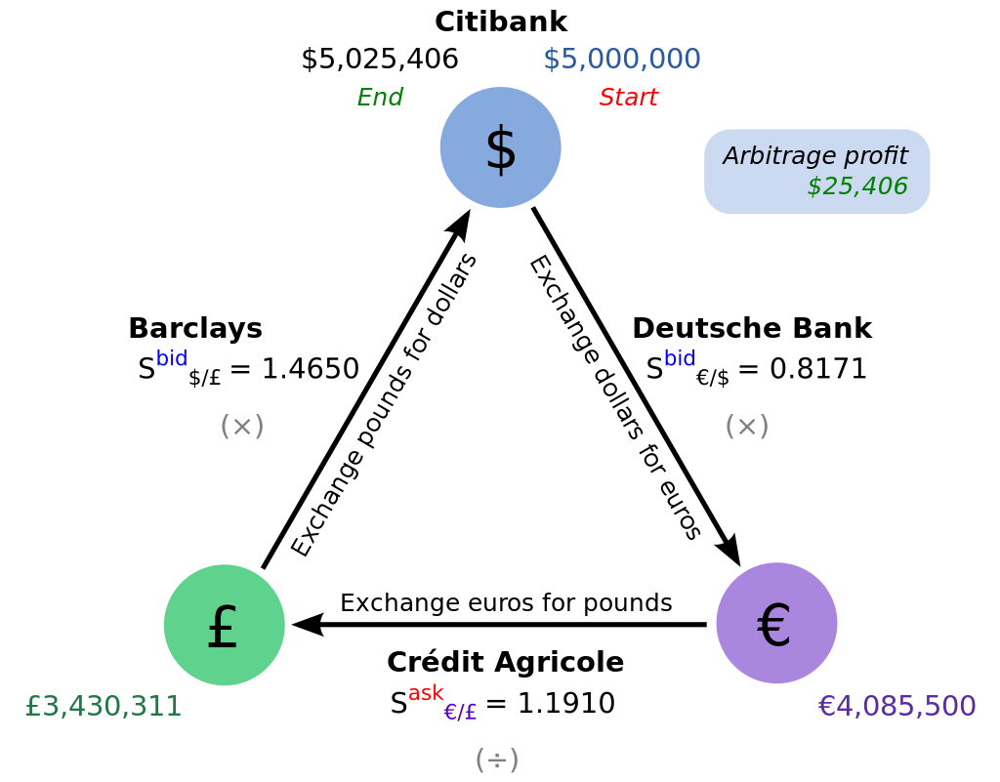

# Rocky & Bullwinke Crypto Trading Bot Combo

## Intro

The goal of this project is to create 2 servers in built in 2 different languages that communicate with eachother to make smart triangluar arbitrage trades on Poloniex and Bittrex (tbd). It can be deployed anywhere but just for fun it can also be setup on raspberry pi.

### The Basic Idea: [Triangular Arbitrage](https://en.wikipedia.org/wiki/Triangular_arbitrage)

## Rocky

A NodeJS-based expressJS server that uses real-time websocket connections to subscribe to all feasible triangular arbitrage combinations, monitor for opportunities, and execute the three trades as quickly as possible. 

Rocky starts by determining the smallest amount it can trade and determines how much it could make from the opportunity. 

Followed by a function that adds a new row to a custom trade history log for Bullwinkle to use to assist in spotting triangles to monitor and determining which factors are most valuable when considering an opportunity. 

* polygonal arbitrage?

## Bullwinkle

A Python Jupyter Notebook that qualifies arbitrage opportunities based on a range of real-time metrics collected by Rocky. 

ML to determine which factors are most important.
confidence intervals

### Fees
> “A trade gets the taker fee if the trade order is matched immediately against an order already on the order book, which is removing liquidity. A trade gets the maker fee if the trade order is not matched immediately against an order already on the order book, which is adding liquidity.”

### TMP NOTES
* Confidence Threshold (0.8)
* Base Currency (and mix, like keep 75% BTC)
* How Far Back (1 yr, 10 days, many tests?)
* Trading Frequency Goal (1-hr frequency buy and sells)
* Raspberry Pi
* An email account so you can get notifications
* Snowball function (give it permission to raise purchase amnt)
* start script?
* config file?
* trade smaller amounts so they get filled faster.
* first things first? decide when to retrain? estimate trading time?
* predict how long training will take?
* remember training logs from previous runs, in csv.
* second, minute, hour, day timeframes?
* timeseries modelling for sure.
* get confidence interval and esitmated profit from strategy
* Trade feed, on a localhost server via raspberry pi?
* Use past data to predict market close or future value, 
* change addresses after each trade.
* what if the bot goes for a 1-2 hour buy-sell goal but if it misses it switches to arbitrage?
* what if the arbitrage functionality was just a function or method, (find_a_way_to_make_base_money('eth'))
* split between high cap and low cap coins
* ETH blockchain takes about 15s to complete a transaction.
* what if it just compares arbitrage to buying and holding for one hour
* Fees! do it programmatically somehow from APIs (these are based on the order book?)
* Keep a log of how long it will take for the order to go through.
* going to need to separate the operational functions from the actual algorithm.

* Shuffle()?

## Dependancies

* NodeJS
* Python > 3
* Websockets
* Polo-node-api